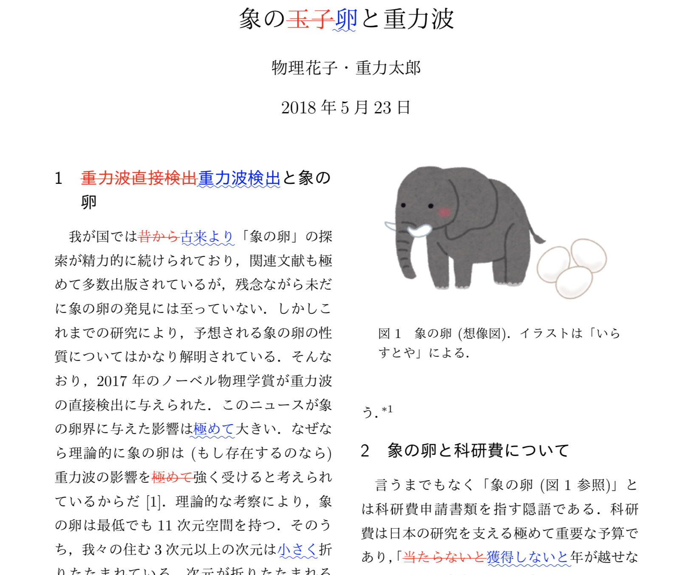

# latexdiffをMakefileから使うサンプル

`make diff`とするとlatexdiffによって差分PDFが作られるサンプルです。

普通に`make`すると現在のLaTeXファイルに対応したPDFが、`make diff`すると、makefileで指定した版との差分PDFを作ります。

Qiitaに[解説記事](https://qiita.com/kaityo256/items/ea4364d6ce134d81c357)を書きました。

